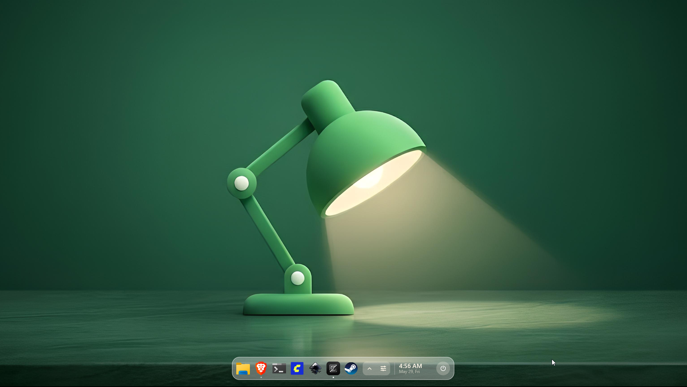

# Reach

> A minimal, lightweight Windows 11 shell replacement.


## Screenshots



## Important notice

Reach replaces windows explorer as the shell, and explorer does not run in the background. This breaks a few apps that rely on it, most importantly Settings. I haven't tested other windows store apps as I don't use it.

Reach uses no external dependencies other than the Windows native APIs.

Don't install Reach if you are not comfortable using the command line. It may break and leave you with a blank screen. A few hotkeys will work even when explorer is not running:

Task manager: CRTL + SHFIT + ESC
Windows quick settings: WIN + A
Project menu: WIN + P

## Features

* **Launcher**

  * Uses Voidtools Everything SDK to search for everything
  * Executables are prioritized in the search

* **Dock**

  * Includes built-in process-kill controls

* **Window management**

  * Manage and organize active windows directly through Reach

* **Tray icons**

  * Reach manages tray icons without explorer running

* **Switcher**

  * Custom app switcher using the **Alt+Tab** hotkey

* **Quick settings**

  * Volume
  * Brightness
  * Internet, Bluetooth toggles
  * Sound device selection
  * Per application volume control

## Build

To build Reach, run:

```powershell
cmake --build build --config Release --target reach_release_zip
```

## Installation

> ⚠️ Reach is in early development. Installing it as your shell completely changes how you interact with windows.

To configure Windows to use Reach as the shell, run as admin:

```powershell
reachctl --install
```

This configures Windows to launch Reach instead of Explorer, effective starting from the next windows session. You only need to do this once to configure Reach.

Then, to start Reach immediately for your current session, run:

```powershell
reachctl --start
```

You don't need to run these commands again. Reach will start automatically when you log in, the same way explorer used to.

You also need Voidtool's Everything installed and running to use the launcher feature.

## License

MIT — see [LICENSE](./LICENSE) for details.
