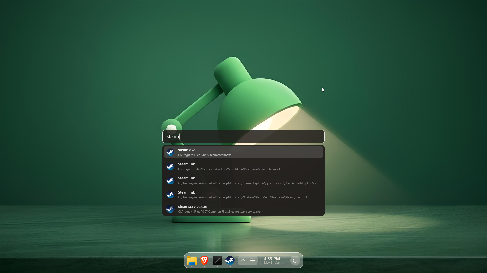
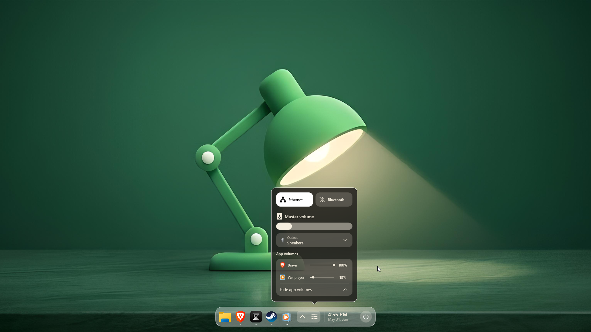
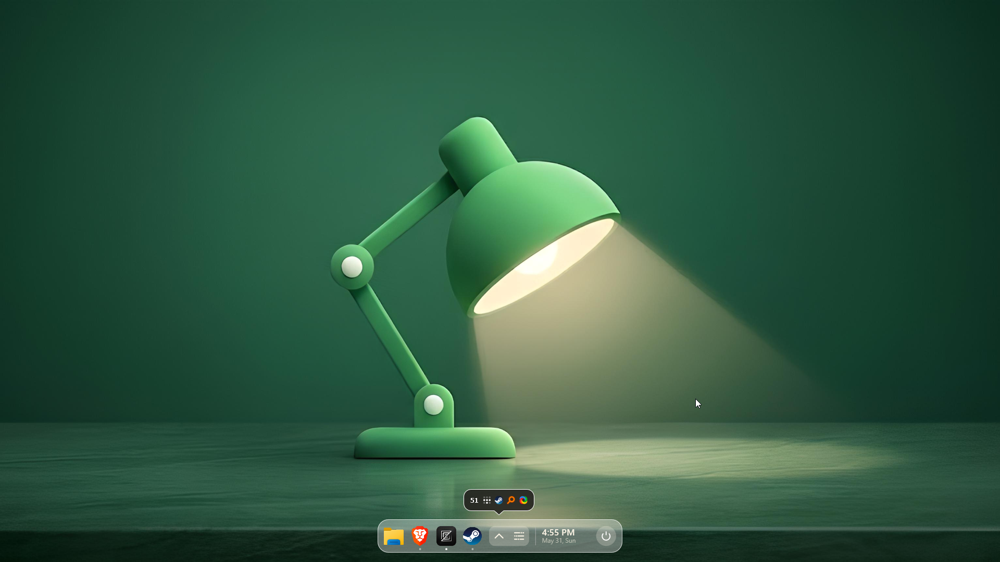

# Reach

> A minimal, lightweight Windows 11 shell replacement.

## Screenshots

<p>


</p>

## Important notice

Reach replaces Windows Explorer as the shell, and Explorer does not run in the background. This breaks a few apps that rely on it, most importantly Settings. I haven't tested other Windows Store apps as I don't use them.

Reach uses no external dependencies other than the Windows native APIs and VoidTools Everything SDK [0]. The launcher uses Voidtools Everything SDK for search, so you need Everything installed and running if you want launcher search to work.

Don't install Reach if you are not comfortable using the command line. It may break and leave you with a blank screen. A few hotkeys will work even when Explorer is not running:

Task manager: CTRL + SHIFT + ESC
Windows quick settings: WIN + A
Project menu: WIN + P

## Features

- **Shell replacement**
  - Reach replaces Windows Explorer as the configured Windows shell
  - `reachctl` for installing, starting, stopping, and resetting the shell
  - `reach-watchdog`, which can offer to restore Explorer if Reach fails

- **Launcher**
  - Uses Voidtools Everything SDK as the search backend
  - Prioritizes executables in search results
  - Supports launching files, folders, shortcuts, and applications

- **Dock**
  - Dynamic sizing and animated resizing
  - Drag-to-reorder pinned apps
  - Pin `.exe` and `.lnk` files from the file explorer context menu
  - App context menu actions, including kill process and open as admin
  - Power menu

- **Window management**
  - Manage and organize active windows directly through Reach
  - App matching with executable paths and AppUserModelIDs
  - The dock stays out of the way when maximizing apps
  - Game mode disables tray icons refreshes and moves Reach out of the way

- **Tray icons**
  - Reach manages tray icons
  - Supports tray icon popups and context menus
  - Starts startup apps and respects disabled ones

- **Switcher**
  - Custom app switcher using the **Alt+Tab** hotkey
  - Uses app names and icons from the running windows

- **Quick settings**
  - Volume
  - Brightness (Limited testing because I don't own a laptop)
  - Internet and Bluetooth toggles
  - Sound device selection
  - Per-application volume control

- **Wallpaper**
  - Reach-rendered wallpaper surface
  - File explorer context menu integration
  - Explorer desktop host compatibility for animated wallpapers

- **Rendering**
  - Direct2D-based renderer
  - POC SVG icon renderer
  - DPI-awareness
  -

## Build

To build Reach, run:

```powershell
cmake --build build --config Release --target reach_release_zip
```

## Installation

> ⚠️ Reach is in early development. Installing it as your shell completely changes how you interact with Windows.

To configure Windows to use Reach as the shell, run as admin:

```powershell
reachctl --install
```

This configures Windows to launch Reach instead of Explorer, effective starting from the next Windows session. You only need to do this once to configure Reach.

Then, to start Reach immediately for your current session, run:

```powershell
reachctl --start
```

You don't need to run these commands again. Reach will start automatically when you log in, the same way Explorer used to.

You also need Voidtools Everything installed and running to use the launcher feature.

In case of a problem, you can reset Windows Explorer as the shell by running this as admin:

```powershell
reachctl --reset
```

## Development notes

Reach is split into small feature modules with platform access pushed behind ports/adapters. The architecture is checked in CI-style tooling instead of being left as a convention.

There are tests for core UI logic, pin configuration, search ranking, dock behavior, and quick settings behavior.

## License

MIT — see [LICENSE](./LICENSE) for details.

[0] License found under third_party/licnese
