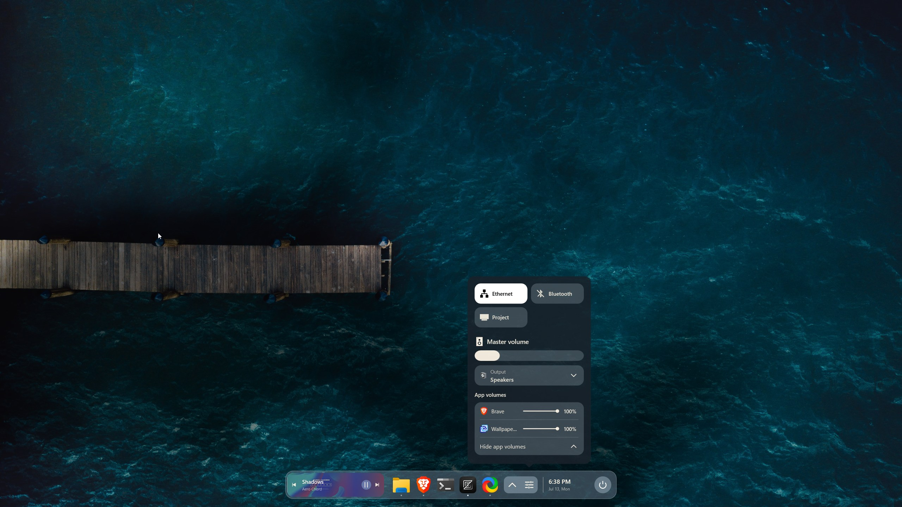
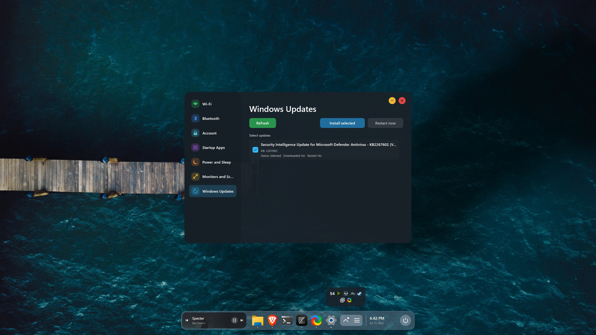
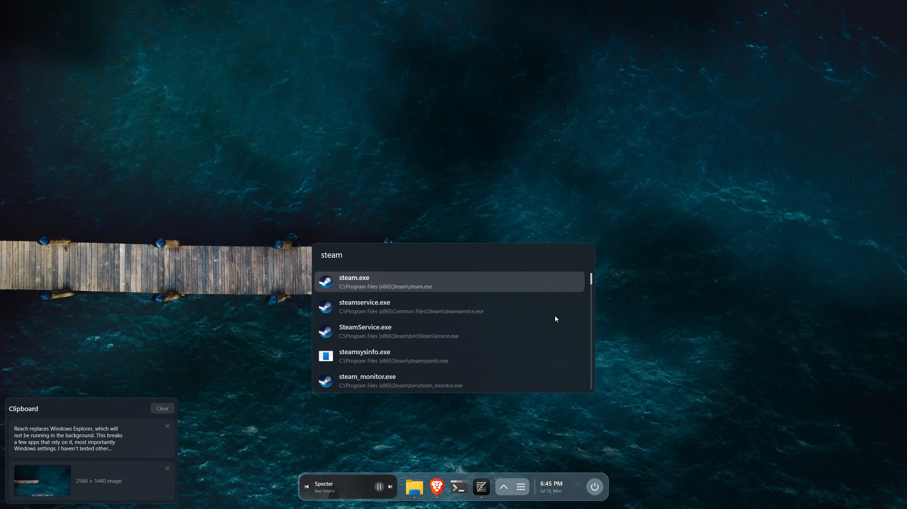
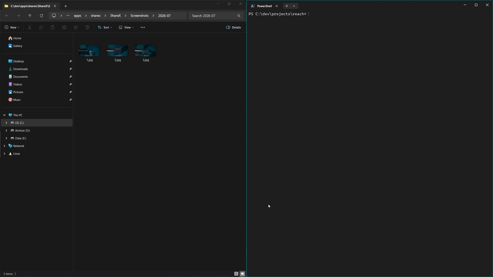

# Reach

> A Direct2d based lightweight Windows 11 desktop replacement.

## Screenshots

<p>


</p>

## Important notice

Reach replaces Windows Explorer, nothing gets deleted, only an entry in the registy gets changed. With reach running a few apps that rely on windows explorer break, most importantly Windows settings. I haven't tested other Windows Store apps as I don't use them.

## Features

- Animated wallpapers through Wallpaper Engine are supported.
- Split screen: WIN + arrow keys snaps the focused window, pressing again maximizes it. Works both horizontally and vertically.
- Now playing media can be controlled on the dock.
- Clipboard history supporting text and image previews.
- Windows security updates can be checked and installed from Reach's own settings app.
- No distractions: no ads, no widgets, no news. Reach also purposefully stops rendering its UI during a game session, disables hotkeys except for alt tab, which will minmimize the game when used.

## Reach app launcher

Press the windows key to open the app launcher and the clipboard history, it uses the retriever search service and can search any file on the NTFS disks.

## Requirements

- Microsoft Visual C++ Redistributable for Visual Studio 2015–2022 (x64)
- The retriever search service will have to be installed and running. You can get it from https://github.com/aymanervn/retriever

## Build

To build Reach, run:

```powershell
cmake -B build
cmake --build build --config Release --target reach_release_zip
```

This produces a zip file with the distributables.

## Installation

Run as admin:

```powershell
./reachctl --install
```

This configures Windows to launch Reach instead of Explorer, effective starting from the next Windows session.
Then, to start Reach immediately for your current session, run:

```powershell
./reachctl --start
```

You also need the retriever service installed and running to use the launcher feature.

In case of a problem, you can reset Windows Explorer as the shell by running this as admin:

```powershell
./reachctl --reset
```

## License

MIT — see [LICENSE](./LICENSE) for details.
