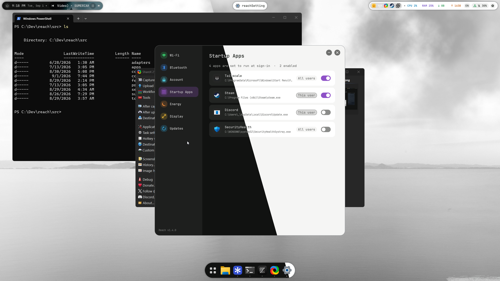
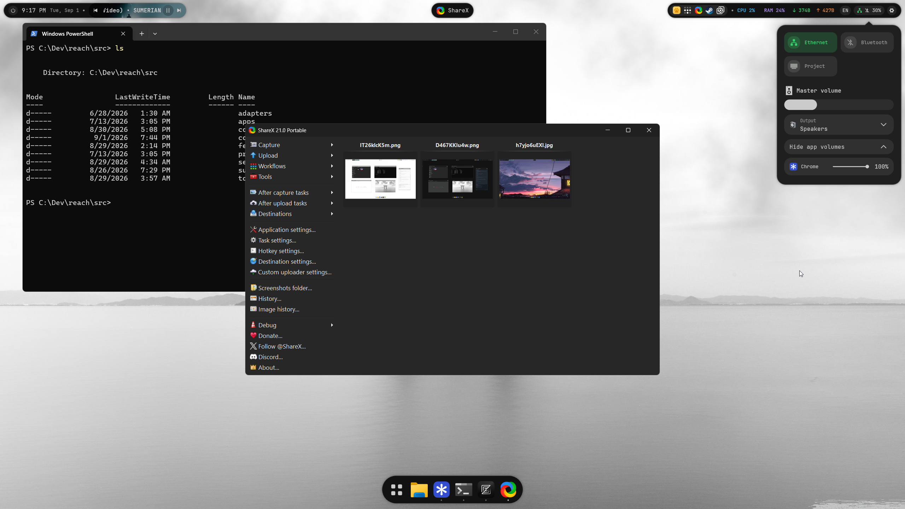
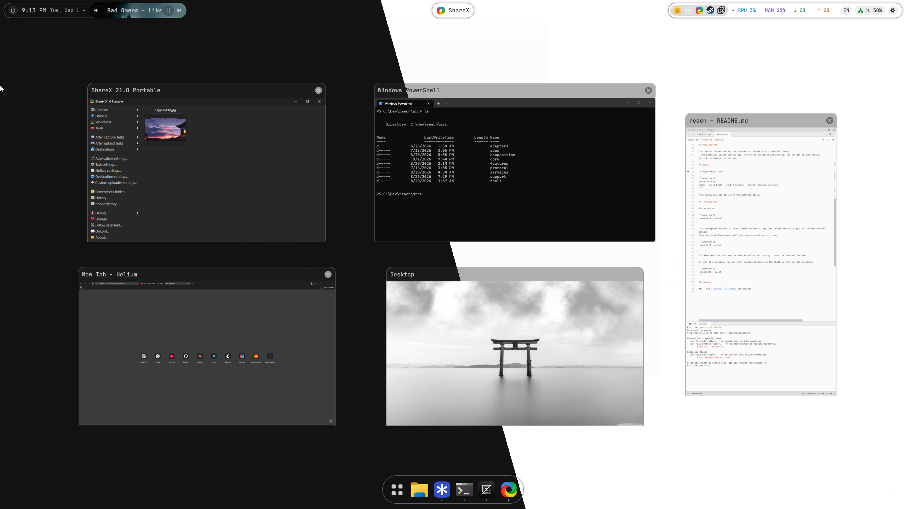
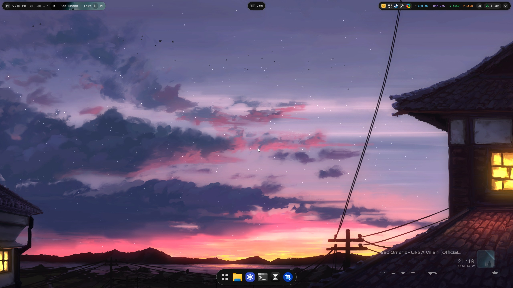

# Reach

> A Direct2d based lightweight Windows 11 desktop replacement.

## Screenshots

<p>


</p>

## Important notice

Reach replaces Windows Explorer, nothing gets deleted, only an entry in the registry gets changed. With reach running a few apps that rely on windows explorer break, most importantly Windows settings. I haven't tested other Windows Store apps as I don't use them.

## Features

- Animated wallpapers through Wallpaper Engine are supported
- Split screen: WIN + arrow keys snaps the focused window, pressing again maximizes it. Works both horizontally and vertically
- Clipboard history supporting text and image previews
- Windows security updates can be searched and installed from Reach's own settings app
- No distractions: no ads, no widgets, no news. Reach also stops rendering its UI during a game session, disables hotkeys except for alt-tab, which will minimize the game when used
- Clean and minimalistic top bar design, includes the clock, current app, now playing, tray icons, keyboard layout, quick settings, volume, power controls and now playing media controls
- Uses JetBrains Mono font as the default
- Stage manager with window thumbnails, close buttons and smooth open and close animations
- Adaptive dock sizing with more room for pinned and running apps, plus drag-to-reorder support for dock apps and tray icons.
- Wifi, Bluetooth, startup apps, system and reach updates in the bundled settings app
- Controls for the system and app themes, including follow Reach, light and dark modes
- Configurable screen off, sleep, shutdown and restart timer
- System HUD for hardware keys such as brightness, audio cotrols and media
- You can run commands directly from the launcher, start by typing ! followed by a command to run it in the windows terminal if available
- The app style is specifically made for good visibility and smooth animations that are consistent across the whole desktop experience 
- See all instances of an open app by hovering on its icon on the dock, and also close it
- Dock and topbar move out of the screen to leave room for windows in case of an overlap during drag or resize events
- Topbar displays live system statistics such as network speed, CPU and RAM usage
- Now playing feature has animated text UI to show the full media title
- Supports up to 120fps animations, can also be set to follow the screen's refresh rate if below 120Hz.
- Keyboard language switch button
- Hovering the top of the screen pulls down the topbar and moves full screen window further below in a smooth animation
- Very low idle CPU usage <0.3% on my system

## Requirements

- Microsoft Visual C++ Redistributable for Visual Studio 2015–2022 (x64)
- The retriever search service will have to be installed and running. You can get it from https://github.com/aymanervn/retriever

## Build

To build Reach, run:

```powershell
cmake -B build
cmake --build build --config Release --target reach_release_zip
```

This produces a zip file with the distributables.

## Installation

Run as admin:

```powershell
./reachctl --install
```

This configures Windows to launch Reach instead of Explorer, effective starting from the next Windows session.
Then, to start Reach immediately for your current session, run:

```powershell
./reachctl --start
```

You also need the retriever service installed and running to use the launcher feature.

In case of a problem, you can reset Windows Explorer as the shell by running this as admin:

```powershell
./reachctl --reset
```

## License

MIT — see [LICENSE](./LICENSE) for details.
